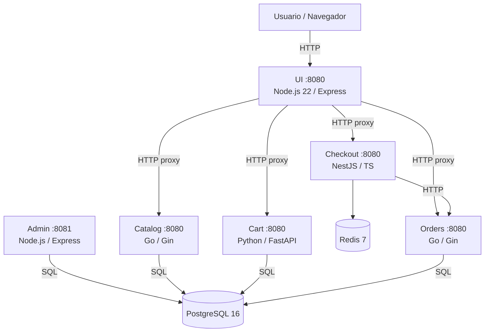
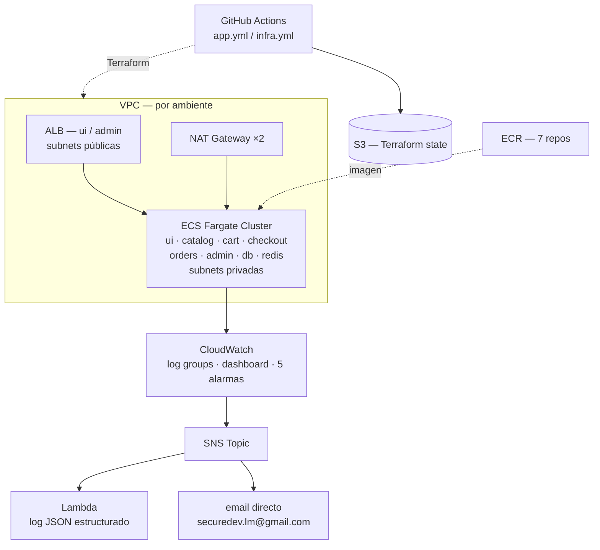
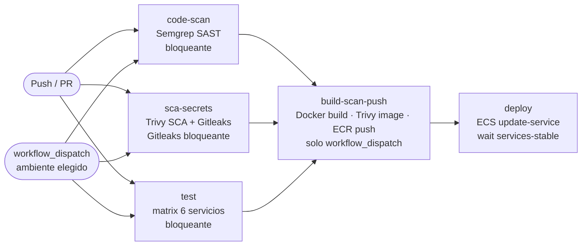
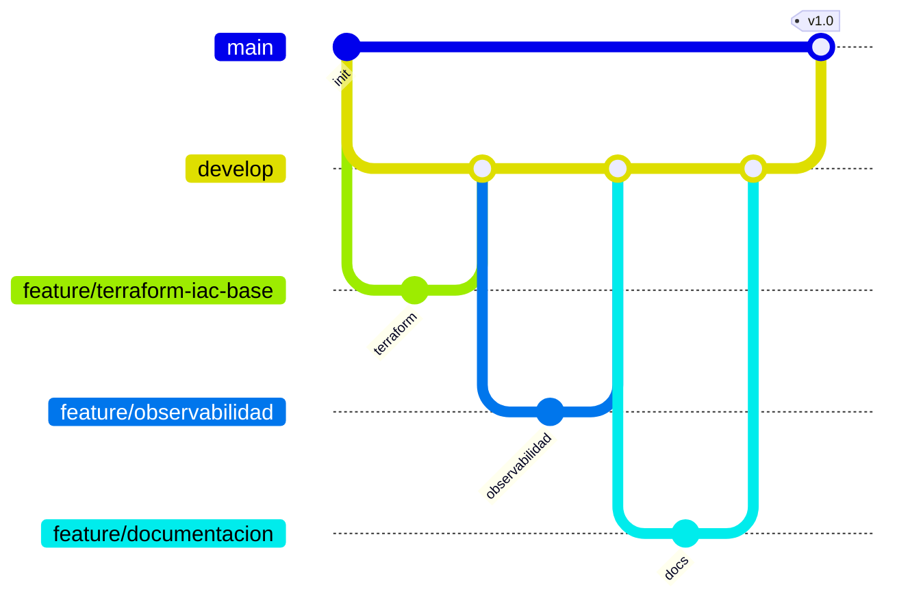

# RetailStore — Plataforma de e-commerce en AWS

Aplicación de e-commerce basada en microservicios. Permite explorar un catálogo de productos, gestionar un carrito de compras, realizar el checkout y consultar órdenes. Incluye un panel de administración para gestionar productos y ver órdenes.

Desplegada en **AWS ECS Fargate** con infraestructura como código en Terraform y pipelines CI/CD en GitHub Actions.

---

## Arquitectura de microservicios



| Servicio     | Lenguaje    | Framework     | Persistencia |
|--------------|-------------|---------------|--------------|
| **ui**       | TypeScript  | Express       | —            |
| **catalog**  | Go 1.24     | Gin + GORM    | PostgreSQL   |
| **cart**     | Python 3.12 | FastAPI       | PostgreSQL   |
| **checkout** | TypeScript  | NestJS        | Redis        |
| **orders**   | Go 1.24     | Gin + GORM    | PostgreSQL   |
| **admin**    | TypeScript  | Express       | PostgreSQL   |
| **db**       | —           | PostgreSQL 16 | —            |
| **redis**    | —           | Redis 7       | —            |

---

## Infraestructura en nube (AWS)



### Ambientes

| Ambiente | VPC CIDR      | CPU / Memoria  | Réplicas | Alarmas email |
|----------|---------------|----------------|----------|---------------|
| dev      | 10.0.0.0/16   | 256 / 512 MB   | 1        | si            |
| test     | 10.1.0.0/16   | 512 / 1024 MB  | 1        | no            |
| prod     | 10.2.0.0/16   | 1024 / 2048 MB | 2        | si            |

Cada ambiente tiene su propia VPC, cluster ECS, ALBs y repositorios ECR. Los ambientes no pueden coexistir simultáneamente (ver [docs/decisiones.md](docs/decisiones.md)).

---

## Estructura del repositorio

```
RetailStore/
├── .github/
│   └── workflows/
│       ├── app.yml              # CI/CD de la aplicación
│       └── infra.yml            # Despliegue de infraestructura
├── db/
│   ├── Dockerfile               # Imagen personalizada de PostgreSQL
│   └── init-db.sql              # Esquema de BD para la imagen Docker
├── src/
│   ├── catalog/                 # Go — catálogo de productos
│   ├── cart/                    # Python — carrito de compras
│   ├── checkout/                # TypeScript/NestJS — proceso de pago
│   ├── orders/                  # Go — gestión de órdenes
│   ├── ui/                      # TypeScript/Express — frontend
│   └── admin/                   # TypeScript/Express — panel admin
├── environments/
│   ├── dev/
│   ├── test/
│   └── prod/                    # main.tf, variables.tf, terraform.tfvars
├── modules/
│   ├── networking/              # VPC, subnets, NAT Gateway, IGW
│   ├── ecr/                     # Repositorios de imágenes Docker
│   ├── ecs/                     # Cluster ECS Fargate
│   ├── ecs_service/             # Task definition, ALB/NLB, service
│   ├── cloudwatch/              # Dashboard y alarmas
│   └── lambda_alert/            # Lambda Python para notificaciones
├── docs/
│   ├── arquitectura.md
│   ├── seguridad.md
│   └── decisiones.md
├── docker-compose.yml           # Ejecución local
└── init-db.sql                  # Esquema de BD para docker-compose local
```

---

## Ejecución local

**Requisitos:** Docker 24+, Docker Compose v2.20+

```bash
cp .env.example .env   # completar con tus propios valores
docker compose up --build
```

| Servicio | URL                   |
|----------|-----------------------|
| Tienda   | http://localhost:8080 |
| Admin    | http://localhost:8081 |

Las credenciales del admin se definen en `.env` (`ADMIN_USERNAME` / `ADMIN_PASSWORD`), no hay valores por defecto en el repositorio.

```bash
docker compose down        # detener
docker compose down -v     # detener y borrar datos
docker compose logs -f <servicio>
```

---

## Despliegue en AWS

### Pre-requisitos

- Cuenta AWS con permisos de administrador (o rol LabRole en AWS Academy)
- AWS CLI configurado (`aws configure`)
- Terraform >= 1.6
- Repositorio forkeado con GitHub Actions habilitado

### Paso 1 — Backend de estado Terraform (S3)

Crear el bucket S3 para el estado remoto **una sola vez**:

```bash
aws s3 mb s3://retailstore-obligatorio-lm-terraform-state \
  --region us-east-1

aws s3api put-bucket-versioning \
  --bucket retailstore-obligatorio-lm-terraform-state \
  --versioning-configuration Status=Enabled
```

### Paso 2 — Secrets en GitHub

Ir a **Settings → Secrets and variables → Actions → New repository secret** y agregar:

| Secret                    | Descripción                              |
|---------------------------|------------------------------------------|
| `AWS_ACCESS_KEY_ID`       | Access key de AWS                        |
| `AWS_SECRET_ACCESS_KEY`   | Secret key de AWS                        |
| `AWS_SESSION_TOKEN`       | Session token (requerido en AWS Academy) |
| `TF_VAR_DB_PASSWORD`      | Contraseña de PostgreSQL                 |
| `TF_VAR_ADMIN_USERNAME`   | Usuario del panel admin                  |
| `TF_VAR_ADMIN_PASSWORD`   | Contraseña del panel admin               |
| `TF_VAR_ADMIN_JWT_SECRET` | Secreto JWT para el admin                |

> En AWS Academy las credenciales expiran cada 4 horas. Actualizar los 3 secrets de AWS antes de cada pipeline.

### Paso 3 — Desplegar infraestructura

**Opción A — GitHub Actions (recomendado):**

Ir a **Actions → Infra CI/CD → Run workflow**, seleccionar el ambiente (`dev`, `test` o `prod`) y ejecutar.

El pipeline realiza: `init` → `fmt check` → `validate` → `plan` → `apply`

**Opción B — Local:**

```bash
cd environments/dev   # o test / prod
terraform init
terraform plan -var-file="terraform.tfvars"
terraform apply -var-file="terraform.tfvars"
```

### Paso 4 — Desplegar aplicación

Ir a **Actions → App CI/CD → Run workflow**, seleccionar el ambiente y ejecutar.

El pipeline realiza: escaneo de seguridad → build de imágenes → push a ECR → deploy en ECS.

Para ver la URL de la UI una vez desplegada:

```bash
aws elbv2 describe-load-balancers \
  --query "LoadBalancers[?contains(LoadBalancerName,'ui')].DNSName" \
  --output text
```

### Paso 5 — Verificar el despliegue

```bash
# Ver estado de los servicios (reemplazar <ambiente> por dev, test o prod)
aws ecs describe-services \
  --cluster retailstore-<ambiente> \
  --services ui catalog cart orders admin checkout db redis \
  --query "services[*].{Servicio:serviceName,Corriendo:runningCount,Deseado:desiredCount}" \
  --output table

# URL pública desde los outputs de Terraform
terraform -chdir=environments/<ambiente> output ui_url
curl -s -o /dev/null -w "%{http_code}" http://<DNS_DEL_ALB>
```

### Paso 6 — Destruir infraestructura

**Via GitHub Actions:** no hay paso de destroy automatizado — usar local para evitar destrucciones accidentales.

```bash
cd environments/dev   # o test / prod
terraform destroy -var-file="terraform.tfvars"
```

> Destruir siempre entre ambientes: NAT Gateways y ALBs generan costo aunque no haya tráfico.

---

## Pipeline CI/CD



| Job               | Trigger            | Bloqueante | Herramienta     |
|-------------------|--------------------|------------|-----------------|
| code-scan         | push / PR / manual | Si         | Semgrep         |
| sca-secrets       | push / PR / manual | Parcial*   | Trivy + Gitleaks|
| test              | push / PR / manual | Si         | por servicio    |
| build-scan-push   | manual             | Si         | Docker + Trivy  |
| deploy            | manual             | Si         | AWS ECS         |

*Trivy SCA e image scan son informativos (no bloqueantes) por CVEs en la app de partida no modificable. Gitleaks es bloqueante.

---

## Módulos Terraform

| Módulo          | Descripción                                                    |
|-----------------|----------------------------------------------------------------|
| `networking`    | VPC, subnets públicas/privadas, IGW, NAT Gateway, tablas de ruteo |
| `ecr`           | Repositorio ECR por servicio con lifecycle policy (10 imágenes) |
| `ecs`           | Cluster ECS Fargate con Container Insights habilitado          |
| `ecs_service`   | Task definition, ALB/NLB, target group, ECS service por app   |
| `cloudwatch`    | Log groups, dashboard, 5 alarmas métricas, SNS topic          |
| `lambda_alert`  | Función Python 3.12 que loguea alarmas como JSON en CloudWatch Logs |

---

## Observabilidad

CloudWatch Dashboard con métricas de los 8 servicios. Alarmas configuradas:

| Alarma              | Métrica                         | Umbral       | Acción           |
|---------------------|---------------------------------|--------------|------------------|
| CPU alta            | ECS CPUUtilization              | > 80%        | SNS → email      |
| Memoria alta        | ECS MemoryUtilization           | > 80%        | SNS → email      |
| Errores 5XX         | ALB HTTPCode_Target_5XX_Count   | > 10 / 5min  | SNS → email      |
| Hosts no saludables | ALB UnHealthyHostCount          | > 0          | SNS → email      |
| Latencia alta       | ALB TargetResponseTime          | > 2s         | SNS → email      |

Las alarmas de dev y prod envían email a `securedev.lm@gmail.com`. Test no tiene email configurado.

---

## Estrategia de ramas (Git Flow)



- `feature/*` → PR a `develop` (revisión con segunda cuenta autorizada por el docente)
- `develop` → PR a `main` para releases
- Push directo a `main` y `develop` bloqueado por reglas de protección de rama
- El pipeline se dispara en push a cualquier rama (escaneos) y manualmente para deploy

---

## Problemas conocidos

**Cart: reconexión a PostgreSQL**

El servicio `cart` abre una conexión a PostgreSQL al iniciar y no reconecta automáticamente si se cierra por timeout. El health check de ECS no usa la base de datos, por lo que el task aparece como `HEALTHY` pero falla al agregar al carrito.

Workaround: forzar un nuevo deployment del servicio cart.

```bash
aws ecs update-service \
  --cluster retailstore-<ambiente> \
  --service cart \
  --force-new-deployment
```

Para la demo: realizar una compra inmediatamente después del deploy para calentar la conexión.

**Ambientes no simultáneos**

Los recursos AWS no incluyen sufijo de ambiente en el nombre (ej: `ui-alb` en vez de `ui-alb-dev`). Dos ambientes no pueden correr en paralelo en la misma cuenta. Ver [docs/decisiones.md](docs/decisiones.md).

---

## Documentación adicional

- [docs/arquitectura.md](docs/arquitectura.md) — diagramas detallados
- [docs/seguridad.md](docs/seguridad.md) — hallazgos de seguridad y CVEs aceptados
- [docs/decisiones.md](docs/decisiones.md) — decisiones de diseño (ADRs)
