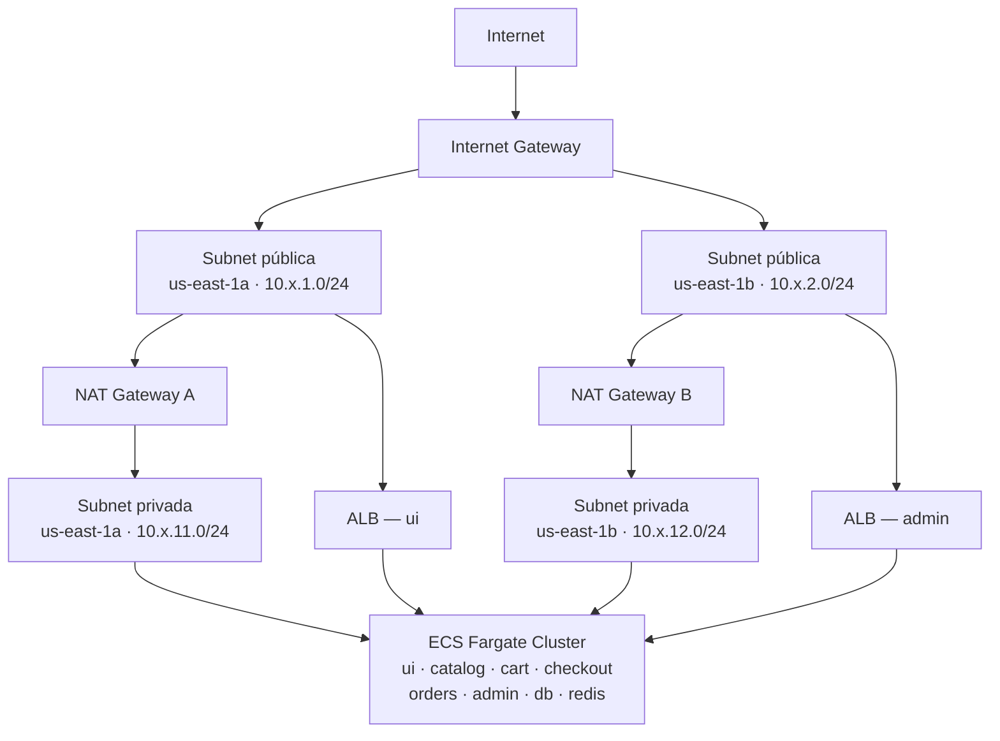
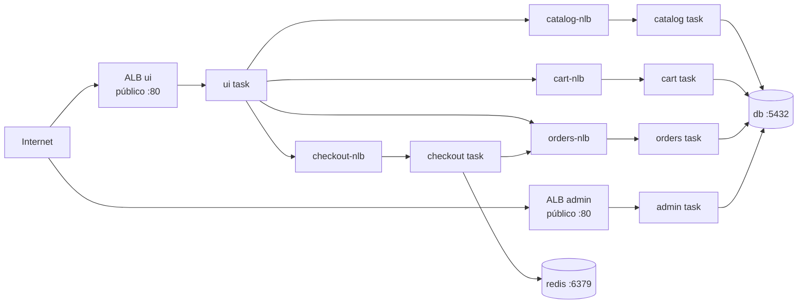
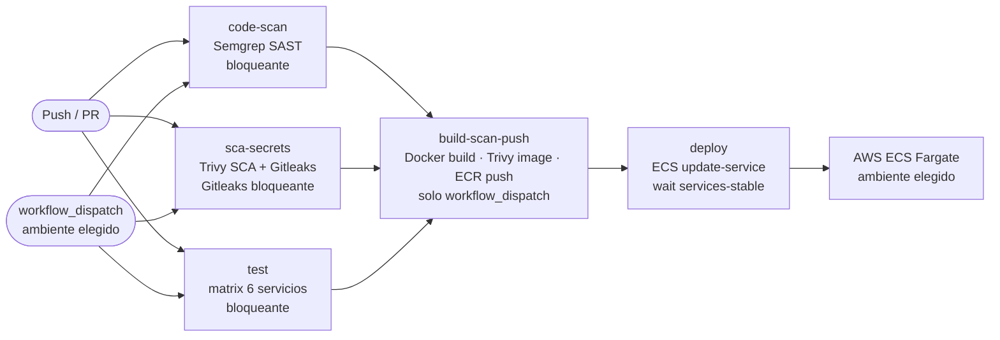
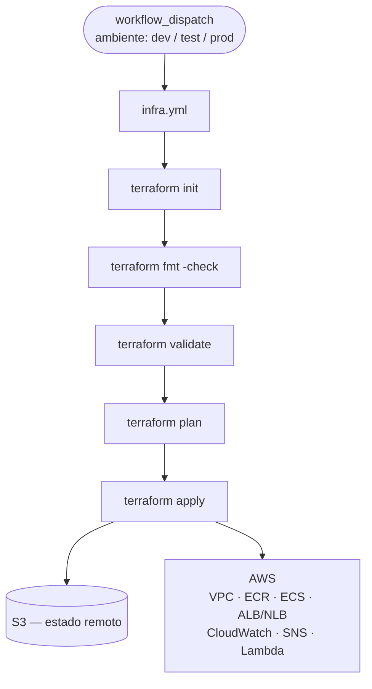
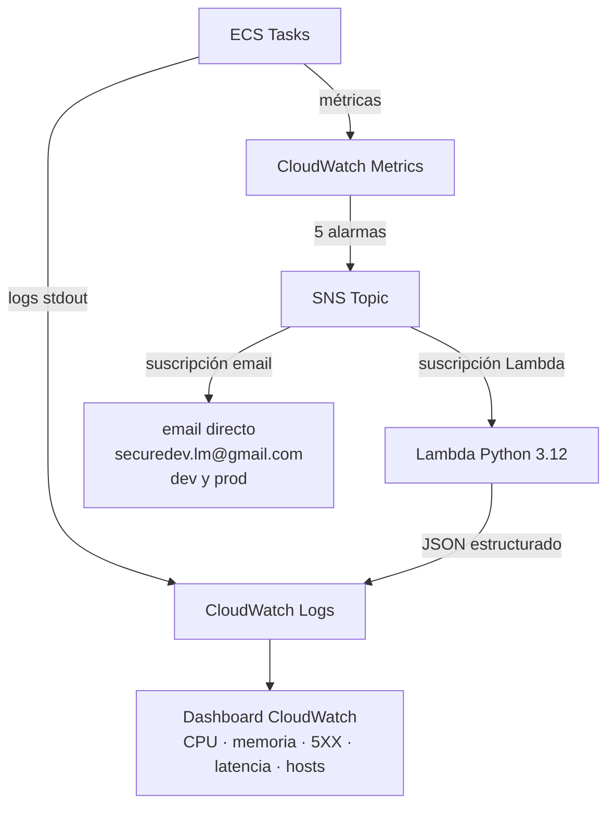
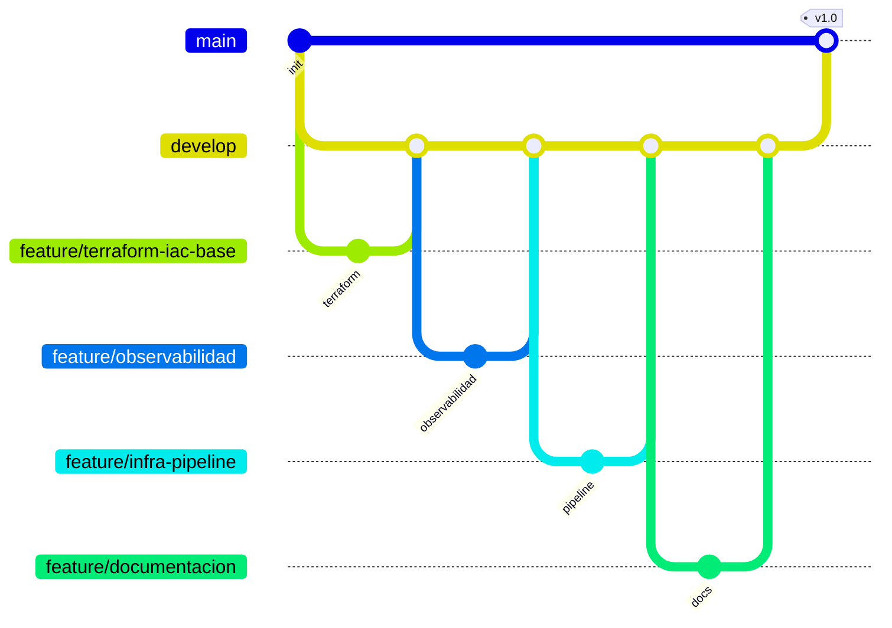
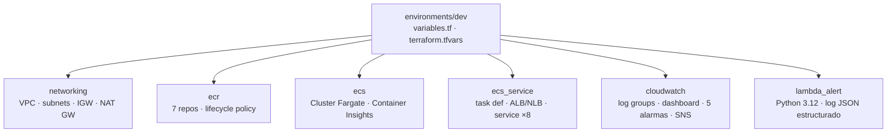

# Arquitectura — RetailStore

## Red y zonas de disponibilidad

Cada ambiente (dev/test/prod) usa su propio bloque CIDR:

| Ambiente | VPC           | Subred pública A  | Subred pública B  | Subred privada A  | Subred privada B  |
|----------|---------------|-------------------|-------------------|-------------------|-------------------|
| dev      | 10.0.0.0/16   | 10.0.1.0/24       | 10.0.2.0/24       | 10.0.11.0/24      | 10.0.12.0/24      |
| test     | 10.1.0.0/16   | 10.1.1.0/24       | 10.1.2.0/24       | 10.1.11.0/24      | 10.1.12.0/24      |
| prod     | 10.2.0.0/16   | 10.2.1.0/24       | 10.2.2.0/24       | 10.2.11.0/24      | 10.2.12.0/24      |

---

## Exposición de servicios

`ui` y `admin` se exponen con **ALB** (HTTP/HTTPS). Los servicios internos usan **NLB** (TCP) porque solo necesitan balanceo de capa 4 sin inspección HTTP.

---

## Pipeline CI/CD — flujo completo

---

## Infraestructura como código — flujo

---

## Observabilidad

---

## Estrategia de ramas

Reglas de protección de rama en `main` y `develop`:

- Push directo bloqueado
- Se requiere al menos 1 aprobación de PR
- Los checks de CI deben pasar antes del merge

---

## Módulos Terraform

