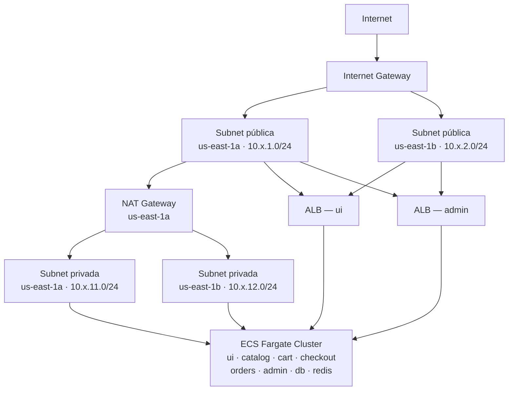
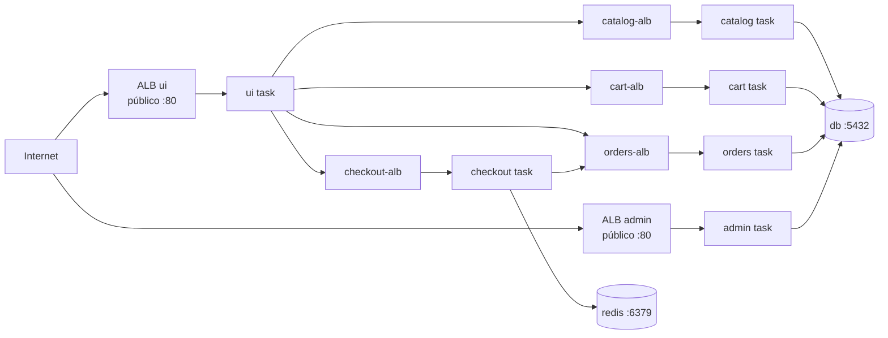
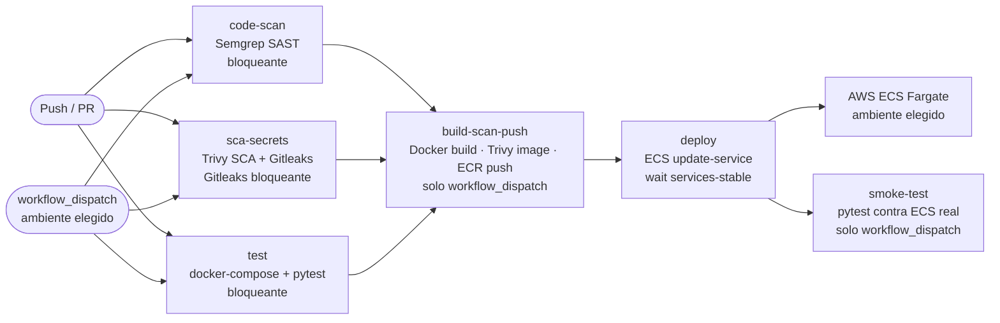
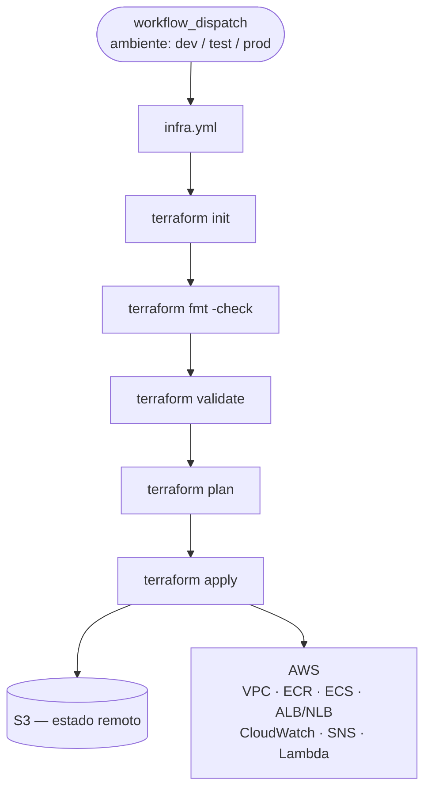
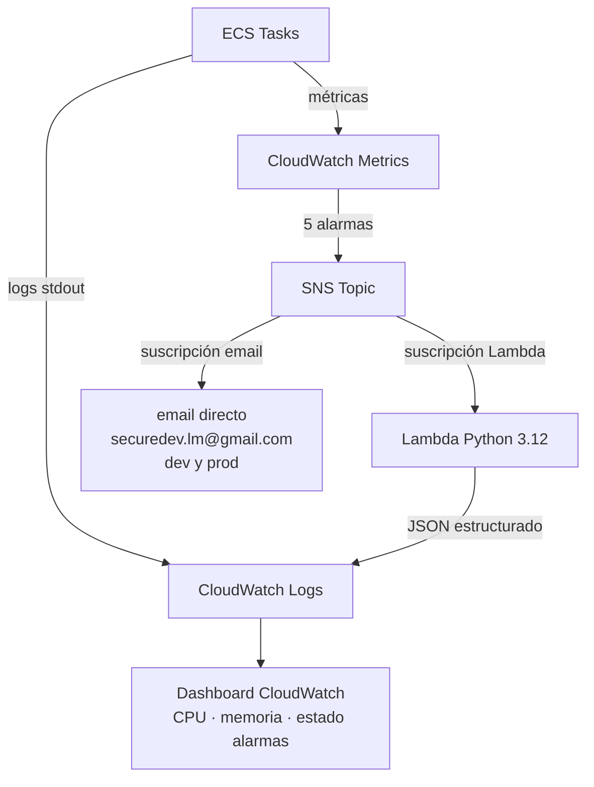
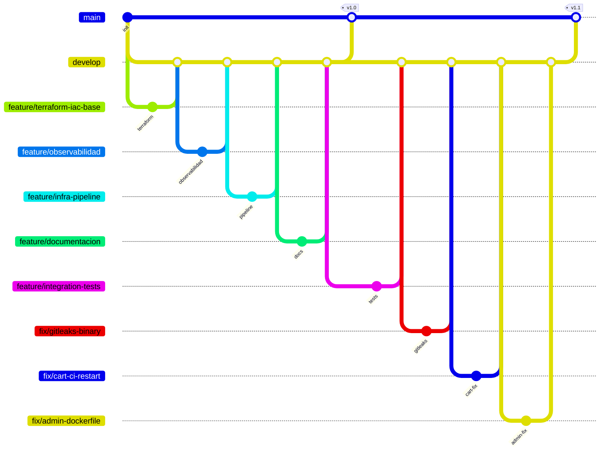
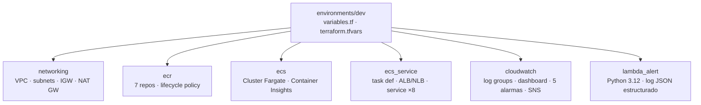

# Arquitectura — RetailStore

## Red y zonas de disponibilidad


```mermaid
graph TD
    Internet --> IGW[Internet Gateway]
    IGW --> PubA["Subnet pública\nus-east-1a · 10.x.1.0/24"]
    IGW --> PubB["Subnet pública\nus-east-1b · 10.x.2.0/24"]
    PubA --> NAT["NAT Gateway\nus-east-1a"]
    PubA --> ALB_UI[ALB — ui]
    PubB --> ALB_UI
    PubA --> ALB_Admin[ALB — admin]
    PubB --> ALB_Admin
    NAT --> PrivA["Subnet privada\nus-east-1a · 10.x.11.0/24"]
    NAT --> PrivB["Subnet privada\nus-east-1b · 10.x.12.0/24"]
    ALB_UI --> ECS["ECS Fargate Cluster\nui · catalog · cart · checkout\norders · admin · db · redis"]
    ALB_Admin --> ECS
    PrivA --> ECS
    PrivB --> ECS
```

Cada ambiente (dev/test/prod) usa su propio bloque CIDR:

| Ambiente | VPC           | Subred pública A  | Subred pública B  | Subred privada A  | Subred privada B  |
|----------|---------------|-------------------|-------------------|-------------------|-------------------|
| dev      | 10.0.0.0/16   | 10.0.1.0/24       | 10.0.2.0/24       | 10.0.11.0/24      | 10.0.12.0/24      |
| test     | 10.1.0.0/16   | 10.1.1.0/24       | 10.1.2.0/24       | 10.1.11.0/24      | 10.1.12.0/24      |
| prod     | 10.2.0.0/16   | 10.2.1.0/24       | 10.2.2.0/24       | 10.2.11.0/24      | 10.2.12.0/24      |

---

## Exposición de servicios


```mermaid
flowchart LR
    Internet --> ALB_UI["ALB ui\npúblico :80"]
    Internet --> ALB_Admin["ALB admin\npúblico :80"]
    ALB_UI --> UI[ui task]
    ALB_Admin --> Admin[admin task]
    UI --> CatALB[catalog-alb]
    UI --> CartALB[cart-alb]
    UI --> ChkALB[checkout-alb]
    UI --> OrdALB[orders-alb]
    CatALB --> Catalog[catalog task]
    CartALB --> Cart[cart task]
    ChkALB --> Checkout[checkout task]
    OrdALB --> Orders[orders task]
    Checkout --> OrdALB
    Checkout --> Redis[(redis :6379)]
    Catalog --> DB[(db :5432)]
    Cart --> DB
    Orders --> DB
    Admin --> DB
```

`ui` y `admin` tienen **ALB público** (`scheme = internet-facing`, en subnets públicas — accesibles desde internet). Los servicios `catalog`, `cart`, `orders` y `checkout` también usan ALB, pero con **`scheme = internal`** — están en subnets privadas y no son accesibles desde internet; solo reciben tráfico desde dentro de la VPC (originado por el task de `ui`). Solo `db` y `redis` usan **NLB** (`internal`, TCP puro) porque sus protocolos no son HTTP. La regla está en `modules/ecs_service/main.tf`: `internal = !var.public`.

---

## Pipeline CI/CD — flujo completo


```mermaid
flowchart LR
    Push(["Push / PR"]) --> CodeScan["code-scan\nSemgrep SAST\nbloqueante"]
    Push --> SCA["sca-secrets\nTrivy SCA + Gitleaks\nGitleaks bloqueante"]
    Push --> Tests["test\ndocker-compose + pytest\nbloqueante"]
    Dispatch(["workflow_dispatch\nambiente elegido"]) --> CodeScan
    Dispatch --> SCA
    Dispatch --> Tests
    CodeScan --> Build["build-scan-push\nDocker build · Trivy image · ECR push\nsolo workflow_dispatch"]
    SCA --> Build
    Tests --> Build
    Build --> Deploy["deploy\nECS update-service\nwait services-stable"]
    Deploy --> ECS_F["AWS ECS Fargate\nambiente elegido"]
    Deploy --> Smoke["smoke-test\npytest contra ECS real\nsolo workflow_dispatch"]
```

---

## Infraestructura como código — flujo


```mermaid
flowchart TD
    WD(["workflow_dispatch\nambiente: dev / test / prod"]) --> Infra[infra.yml]
    Infra --> Init[terraform init]
    Init --> Fmt[terraform fmt -check]
    Fmt --> Validate[terraform validate]
    Validate --> Plan[terraform plan]
    Plan --> Apply[terraform apply]
    Apply --> S3[(S3 — estado remoto)]
    Apply --> AWS["AWS\nVPC · ECR · ECS · ALB/NLB\nCloudWatch · SNS · Lambda"]
```

---

## Observabilidad


```mermaid
flowchart TD
    ECS[ECS Tasks] -->|métricas| CWM[CloudWatch Metrics]
    ECS -->|logs stdout| CWL[CloudWatch Logs]
    CWM -->|5 alarmas| SNS[SNS Topic]
    SNS -->|suscripción Lambda| Lambda[Lambda Python 3.12]
    SNS -->|suscripción email| Email["email directo\nsecuredev.lm@gmail.com\ndev y prod"]
    Lambda -->|JSON estructurado| CWL
    CWL --> Dashboard["Dashboard CloudWatch\nCPU · memoria · estado alarmas"]
```

---

## Estrategia de ramas


```mermaid
gitGraph
   commit id: "init"
   branch develop
   checkout develop
   branch "feature/terraform-iac-base"
   checkout "feature/terraform-iac-base"
   commit id: "terraform"
   checkout develop
   merge "feature/terraform-iac-base"
   branch "feature/observabilidad"
   checkout "feature/observabilidad"
   commit id: "observabilidad"
   checkout develop
   merge "feature/observabilidad"
   branch "feature/infra-pipeline"
   checkout "feature/infra-pipeline"
   commit id: "pipeline"
   checkout develop
   merge "feature/infra-pipeline"
   branch "feature/documentacion"
   checkout "feature/documentacion"
   commit id: "docs"
   checkout develop
   merge "feature/documentacion"
   checkout main
   merge develop tag: "v1.0"
   checkout develop
   branch "feature/integration-tests"
   checkout "feature/integration-tests"
   commit id: "tests"
   checkout develop
   merge "feature/integration-tests"
   branch "fix/gitleaks-binary"
   checkout "fix/gitleaks-binary"
   commit id: "gitleaks"
   checkout develop
   merge "fix/gitleaks-binary"
   branch "fix/cart-ci-restart"
   checkout "fix/cart-ci-restart"
   commit id: "cart-fix"
   checkout develop
   merge "fix/cart-ci-restart"
   branch "fix/admin-dockerfile"
   checkout "fix/admin-dockerfile"
   commit id: "admin-fix"
   checkout develop
   merge "fix/admin-dockerfile"
   checkout main
   merge develop tag: "v1.1"
```

Reglas de protección de rama en `main` y `develop`:

- Push directo bloqueado
- Se requiere al menos 1 aprobación de PR
- Los checks de CI deben pasar antes del merge

---

## Módulos Terraform


```mermaid
graph TD
    DEV["environments/dev\nvariables.tf · terraform.tfvars"]
    NET["networking\nVPC · subnets · IGW · NAT GW"]
    ECR["ecr\n7 repos · lifecycle policy"]
    ECS_C["ecs\nCluster Fargate · Container Insights"]
    ECSSVC["ecs_service\ntask def · ALB/NLB · service ×8"]
    CW["cloudwatch\nlog groups · dashboard · 5 alarmas · SNS"]
    LAMBDA["lambda_alert\nPython 3.12 · log JSON estructurado"]

    DEV --> NET
    DEV --> ECR
    DEV --> ECS_C
    DEV --> ECSSVC
    DEV --> CW
    DEV --> LAMBDA
```

---

## Recursos creados por Terraform

| Tipo | Cantidad | Nombres |
|---|---|---|
| VPC | 1 | `retailstore-dev` |
| Subnets públicas | 2 | `10.0.1.0/24` (us-east-1a) · `10.0.2.0/24` (us-east-1b) |
| Subnets privadas | 2 | `10.0.11.0/24` (us-east-1a) · `10.0.12.0/24` (us-east-1b) |
| Internet Gateway | 1 | — |
| NAT Gateway | 1 | Solo en us-east-1a — decisión de costo de lab |
| ALB públicos | 2 | `ui-alb` · `admin-alb` |
| ALB internos | 4 | `catalog-alb` · `cart-alb` · `orders-alb` · `checkout-alb` |
| NLB internos | 2 | `db-nlb` · `redis-nlb` |
| ECR repos | 7 | `retailstore-{servicio}-dev` (redis usa imagen pública) |
| ECS cluster | 1 | `retailstore-dev` |
| ECS services | 8 | ui · admin · catalog · cart · orders · checkout · db · redis |
| CloudWatch alarms | 5 | sobre el servicio `ui` |
| SNS topic | 1 | `retailstore-ui-alarms` |
| Lambda | 1 | `retailstore-alert-handler-dev` |

---

## Conexiones entre módulos Terraform

Los outputs de cada módulo se inyectan como variables de entorno en los task definitions:

```
module.ecs_service_l0["db"].endpoint_dns_name
    → RETAIL_CATALOG_PERSISTENCE_ENDPOINT (catalog)
    → CART_POSTGRES_HOST + CART_POSTGRES_PORT (cart)
    → RETAIL_ORDERS_PERSISTENCE_ENDPOINT (orders)
    → DB_HOST + DB_PORT (admin)

module.ecs_service_l0["redis"].endpoint_dns_name
    → RETAIL_CHECKOUT_PERSISTENCE_REDIS_URL (checkout)

module.ecs_service_l1["catalog"].endpoint_dns_name
    → RETAIL_UI_ENDPOINTS_CATALOG (ui)

module.ecs_service_ui.{alb_arn_suffix, target_group_arn_suffix, service_name}
    → módulo cloudwatch (alarmas sobre ui)

module.cloudwatch.sns_topic_arn
    → módulo lambda_alert (suscripción SNS)
```

---

## Configuración por ambiente

| Variable | dev | test | prod |
|---|---|---|---|
| `vpc_cidr_block` | `10.0.0.0/16` | `10.1.0.0/16` | `10.2.0.0/16` |
| `task_cpu` | 256 | 512 | 1024 |
| `task_memory` | 512 MB | 1024 MB | 2048 MB |
| `desired_count` | 1 | 1 | 2 |
| `alarm_email` | sí | no | sí |
