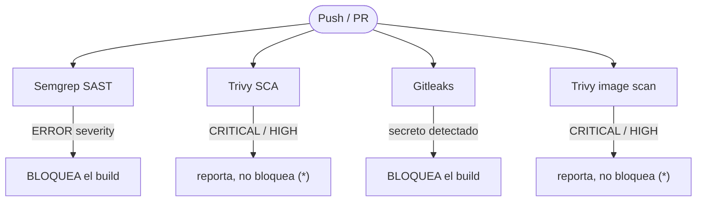

# Seguridad — RetailStore

## Herramientas integradas en el pipeline

| Herramienta | Etapa    | Tipo  | Bloqueante | Qué analiza                          |
|-------------|----------|-------|------------|--------------------------------------|
| Semgrep     | code-scan | SAST  | Si         | Código fuente en `src/`              |
| Trivy SCA   | sca-secrets | SCA | No *       | Dependencias de todos los servicios  |
| Gitleaks    | sca-secrets | Secretos | Si    | Credenciales hardcodeadas en el repo |
| Trivy image | build-scan-push | Image scan | No * | Imágenes Docker antes del push a ECR |

\* No bloqueante por CVEs en la app de partida — ver sección siguiente.

---

## SAST — Semgrep

Ejecuta en todo push y pull request con `--config=auto --error --severity ERROR`.

**Resultado:** sin hallazgos de severidad ERROR en el código desarrollado para este proyecto. Los pipelines, módulos Terraform y Dockerfiles pasan el escaneo sin errores bloqueantes.

**Reporte:** disponible como artifact `semgrep-report` en cada ejecución de GitHub Actions (formato SARIF).

---

## SCA — Trivy (análisis de dependencias)

Escanea el árbol de dependencias de todos los servicios buscando CVEs conocidos.

**Hallazgos:** CVEs de severidad CRITICAL y HIGH en dependencias de la aplicación de partida.

**Decisión:** no bloqueante (`exit-code: "0"`).

**Justificación:** la consigna del proyecto prohíbe modificar el código de la aplicación de partida. Las vulnerabilidades están en dependencias transitivas que no pueden parchearse sin cambiar el código fuente original. Se documentan como riesgo aceptado.

**Recomendación para producción:** actualizar las dependencias afectadas o reemplazarlas por alternativas sin CVEs activos.

**Reporte:** disponible como artifact `trivy-sca-report` en cada ejecución.

---

## Image scan — Trivy (imágenes Docker)

Escanea cada imagen construida antes de publicarla en ECR.

**Hallazgos:** los mismos CVEs detectados en SCA se propagan a las imágenes porque provienen de las dependencias de la aplicación base.

**Decisión:** no bloqueante, misma justificación que SCA.

**Reporte:** disponible como artifact `trivy-image-report-<servicio>` por cada servicio.

---

## Detección de secretos — Gitleaks

Escanea el historial completo del repositorio buscando credenciales, tokens y claves expuestas.

**Resultado:** sin secretos detectados. El pipeline es bloqueante — si Gitleaks detecta una credencial, el build falla.

**Prácticas aplicadas:**
- `.env` en `.gitignore` — nunca se commitea
- Credenciales en GitHub Secrets, no en el código
- Variables sensibles de Terraform marcadas como `sensitive = true` en `variables.tf`
- `.env.example` con valores de ejemplo, sin credenciales reales

---

## Quality gates

`(*)` riesgo documentado y aceptado — app de partida no modificable

---

## Manejo de secretos en infraestructura

| Secreto                      | Almacenamiento          | En Terraform state |
|------------------------------|-------------------------|--------------------|
| `TF_VAR_DB_PASSWORD`         | GitHub Secret           | `sensitive = true` |
| `TF_VAR_ADMIN_USERNAME`      | GitHub Secret           | `sensitive = true` |
| `TF_VAR_ADMIN_PASSWORD`      | GitHub Secret           | `sensitive = true` |
| `TF_VAR_ADMIN_JWT_SECRET`    | GitHub Secret           | `sensitive = true` |
| `AWS_ACCESS_KEY_ID`          | GitHub Secret           | No aplica          |
| `AWS_SECRET_ACCESS_KEY`      | GitHub Secret           | No aplica          |
| `AWS_SESSION_TOKEN`          | GitHub Secret           | No aplica          |

El estado de Terraform se almacena en S3 con versionado habilitado. Los valores marcados como `sensitive` no aparecen en el output del plan ni del apply.

---

## Buenas prácticas en Dockerfiles

Aplicadas en los 7 Dockerfiles del proyecto:

- **Multi-stage build:** la imagen final no incluye herramientas de compilación ni dependencias de desarrollo
- **Imagen base mínima:** Alpine Linux o Python slim según el servicio
- **Usuario no-root:** todos los contenedores corren con un usuario sin privilegios
- **`.dockerignore`:** excluye `node_modules`, `__pycache__`, archivos de test y credenciales locales

---

## Riesgos aceptados y pendientes

| Riesgo                                  | Impacto | Decisión           | Recomendación                          |
|-----------------------------------------|---------|--------------------|----------------------------------------|
| CVEs en dependencias de la app base     | Alto    | Aceptado           | Actualizar dependencias cuando sea posible |
| Cart: no reconecta a PostgreSQL         | Medio   | Workaround manual  | Usar connection pool con `pool_pre_ping=True` |
| Email SNS no entrega en entorno de lab  | Bajo    | Documentado        | Verificar con servidor de correo corporativo |
